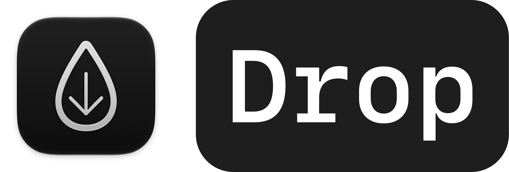
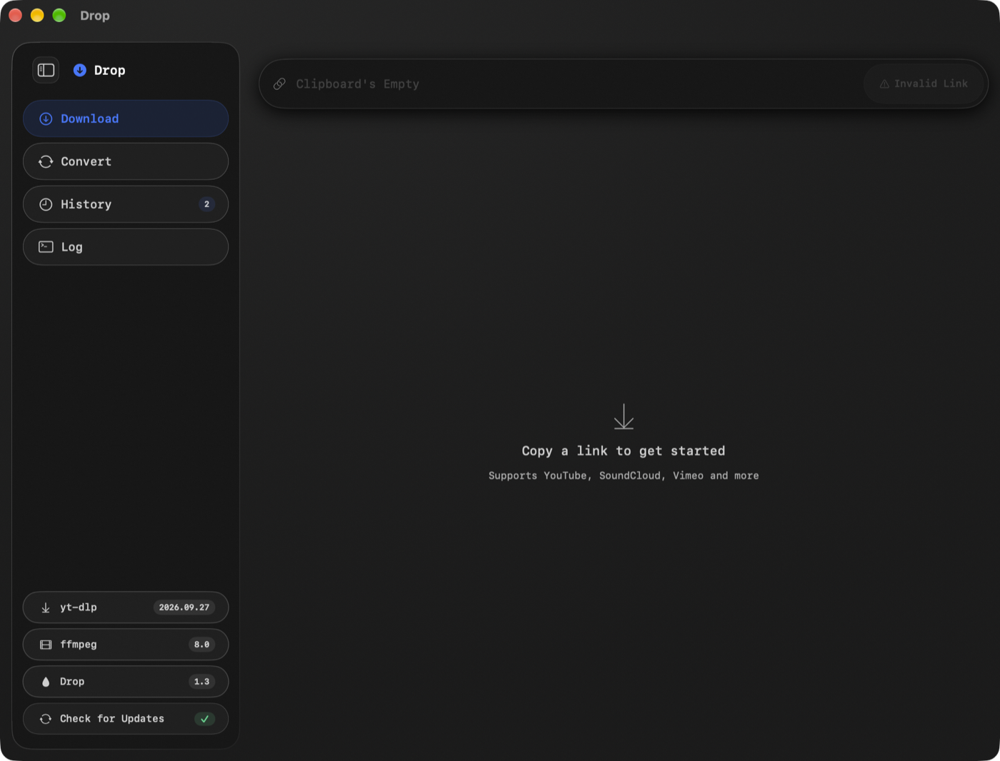
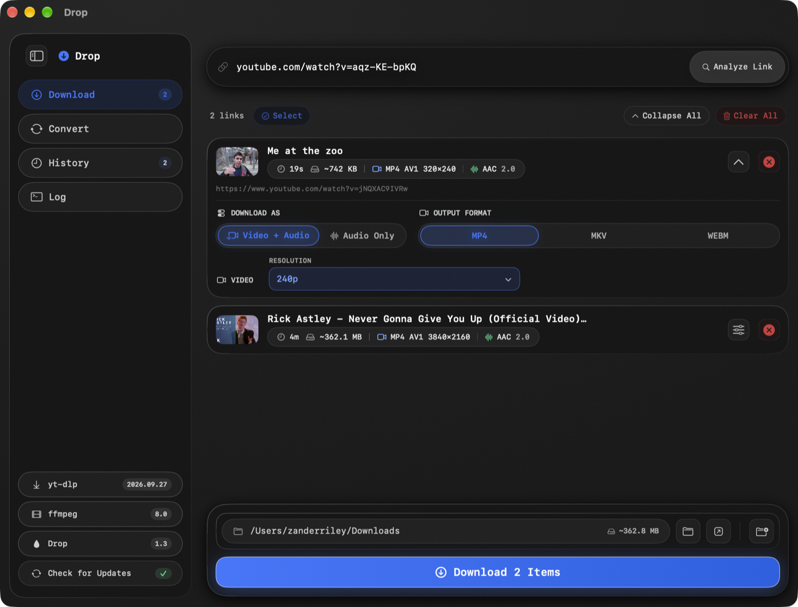
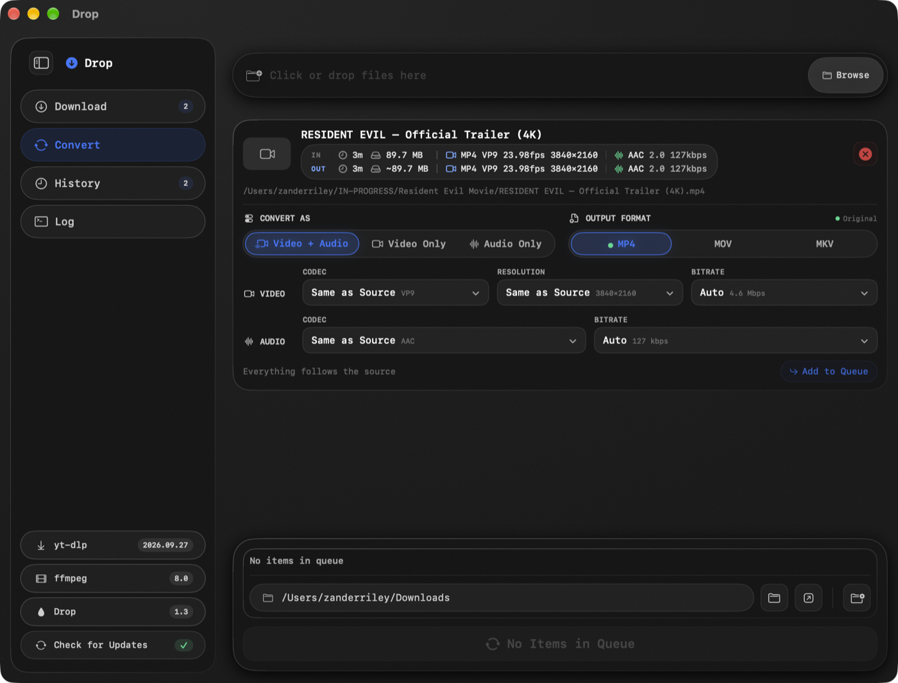
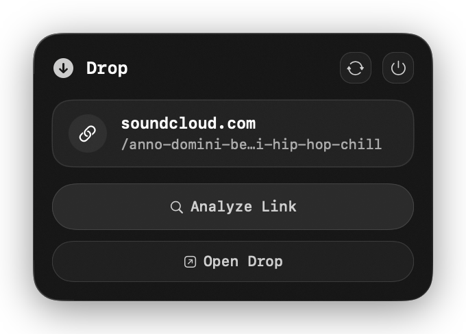
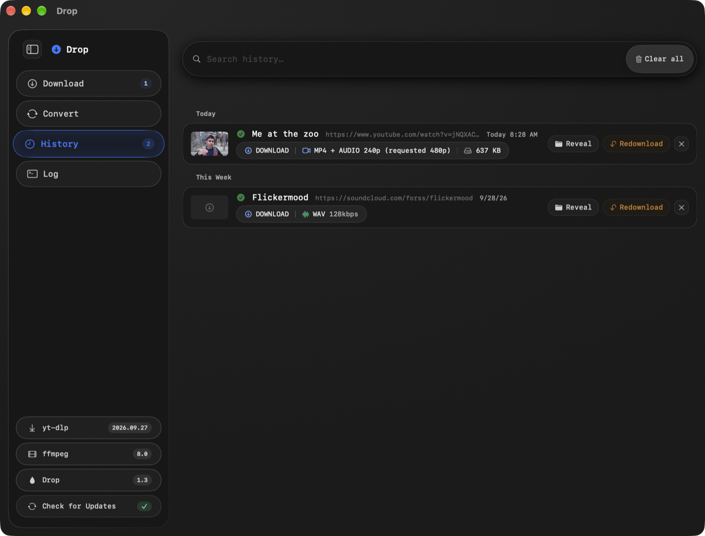

  

  
  
  

Drop is a fast, native macOS app for downloading and converting online video and audio. Paste a link, pick a quality, and Drop handles the rest — powered by <a href="https://github.com/yt-dlp/yt-dlp">yt-dlp</a> and <a href="https://ffmpeg.org/">ffmpeg</a>, wrapped in a clean SwiftUI interface with a dark liquid-glass design.

  

## How it works

### Download

Paste a YouTube, SoundCloud, or Vimeo link — Drop reads it straight from your clipboard. Pick a format, resolution, and audio quality, then download. Multiple links queue up and download independently, each with its own settings.

  

### Convert

Drop a local video or audio file to re-encode it or just change containers. Codec, resolution, and bitrate default to "Same as Source" — Drop only touches what you actually change, copying streams instead of re-encoding them wherever it can.

  

### Quick access from the menu bar

Copy a link anywhere and click Drop's menu bar icon — it shows what's on your clipboard and lets you analyze it without switching apps or losing focus on what you're doing.

  

### History

Every download is logged with its original link, so redownloading or retrying a failed one is one click — no need to find and re-paste the URL.

  

## Features

- **Paste-and-go downloading** — paste any supported link (YouTube, Soundcloud, and Vimeo via yt-dlp), choose your quality and format, and download.
- **Menu bar quick access** — paste a link from anywhere and Drop picks it up without stealing focus from what you're doing.
- **Download history** — every past download is tracked with one-click redownload/retry that reuses the original analyzed link, no need to re-paste.
- **In-app updates** — Drop can detect latest GitHub Releases and can update itself, it also keeps yt-dlp and ffmpeg updated, all integrated directly into the app.

## Requirements

- macOS 14 (Sonoma) or later
- Apple Silicon or Intel Mac

## Installation

Download the latest `Drop.dmg` from the [Releases page](https://github.com/Degrager/Drop/releases/latest), open it, and drag Drop into your Applications folder.

Since Drop is distributed outside the Mac App Store, macOS Gatekeeper will flag it as being from an unidentified developer on first launch. Right-click (or Control-click) the app and choose **Open** to bypass this the first time.

## Building from source

1. Clone this repository.
2. Open `Drop.xcodeproj` in Xcode 16 or later.
3. Build and run the `Drop` scheme (Release configuration recommended for normal use).

## Updates

Drop can update itself. Click Check For Updates in the sidebar and it will automatically install the latest version directly from this repository's [Releases](https://github.com/Degrager/Drop/releases) — no need to redownload manually.

## License

All rights reserved. Source is provided for transparency and self-building; redistribution of modified builds is not permitted.
